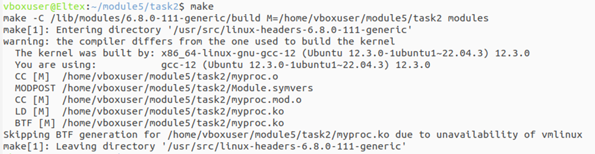
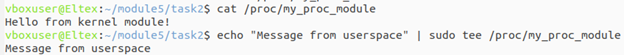
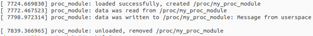

## Задание 2 по модулю 5: Написать модуль ядра для своей версии ядра, который будет обмениваться информацией с userspace через proc. Адаптировать для своей версии ядра (структура обработчиков). Избавиться от хардкода (магических чисел) и изолировать переменные модуля (static).

## Скриншоты

### Сборка модуля

### Работа с /proc (запись и чтение)

### Логи ядра (dmesg)

