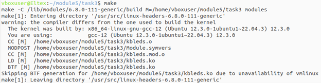
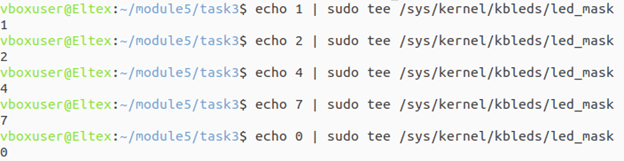
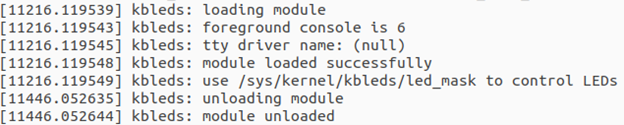

## Задание 3 по модулю 5: Используя исходники модуля ядра (приведённые в задании), сделать мигание лампочек на клавиатуре через ioctl. Управление миганием сделать через sysfs. Значение — двоичная маска: 1 (001) — Scroll Lock, 2 (010) — Num Lock, 4 (100) — Caps Lock, 7 (111) — все три.

## Скриншоты

### Сборка модуля

### Управление через sysfs (запись маски и работа лампочек)

### Логи ядра (dmesg)

