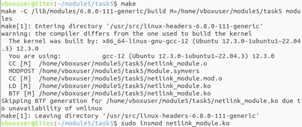
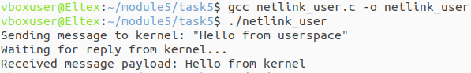
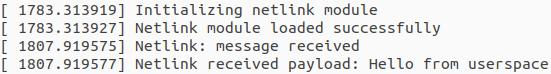

## Задание 5 по модулю 5: Написать модуль ядра для своей версии ядра, который будет обмениваться информацией с userspace через netlink.

## Скриншоты

### Сборка модуля

### Отправка сообщения из userspace и получение ответа от ядра

### Логи ядра (dmesg)

